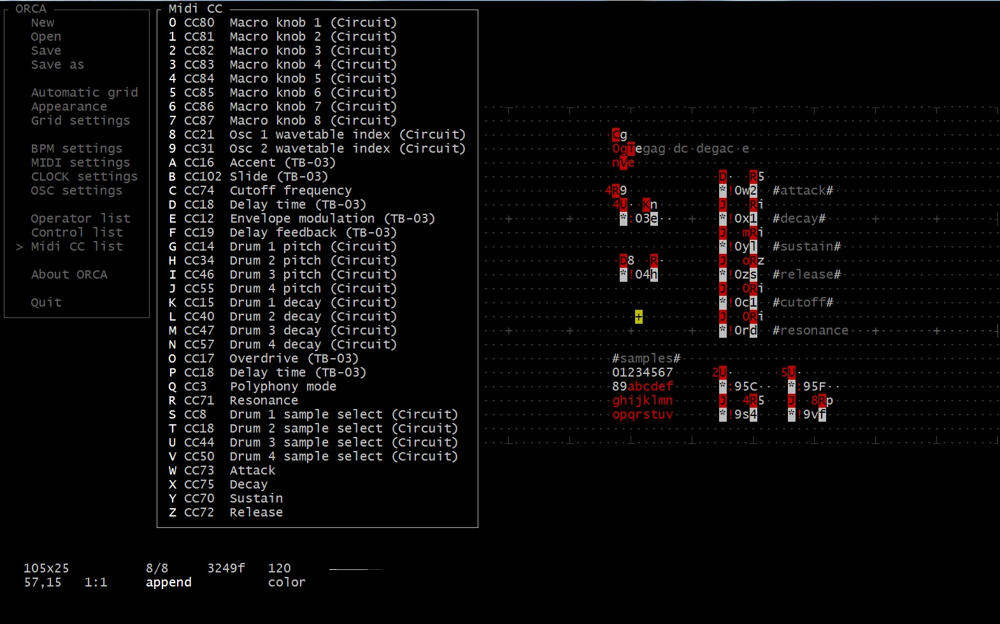

# ORCΛ

This is my personal version of ORCΛ, with customized menu and MIDI CC routing. 

Orca is a programming language designed to quickly create procedural sequencers, in which every letter of the alphabet is an operation, where lowercase letters operate on bang, uppercase letters operate each frame.

Here you find the **C** implementation of the [ORCΛ](https://github.com/hundredrabbits/Orca) language and tools. The livecoding environment for this C version runs in a terminal. It's designed to be power efficient. It can handle large files, even if your terminal is small.

Forked from [hundredrabbits/Orca-c](https://github.com/hundredrabbits/Orca-c)
